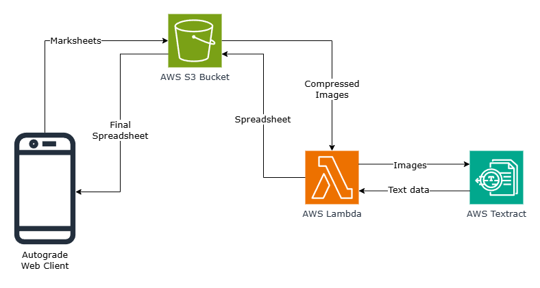

# Autograder

Autograder automates the process of putting marksheet data on spreadsheet.

Made as a semester project for and under the supervision of [Dr. Shobhanjana Kalita](https://linkedin.com/in/shobhanjana-kalita-6751281a).

## Architecture

Built with Next.js, deployed on AWS Lambda and AWS S3. Text extraction is powered by AWS Textract.

This is a beta version, designed specifically for Tezpur University's marksheet format.

